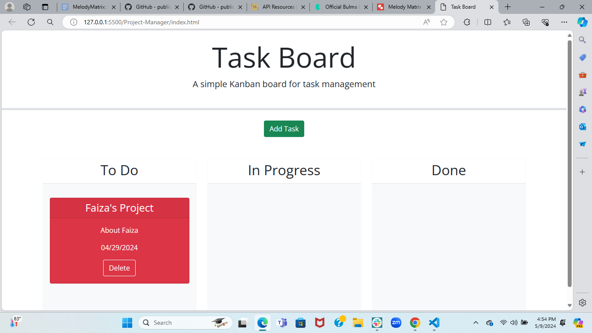
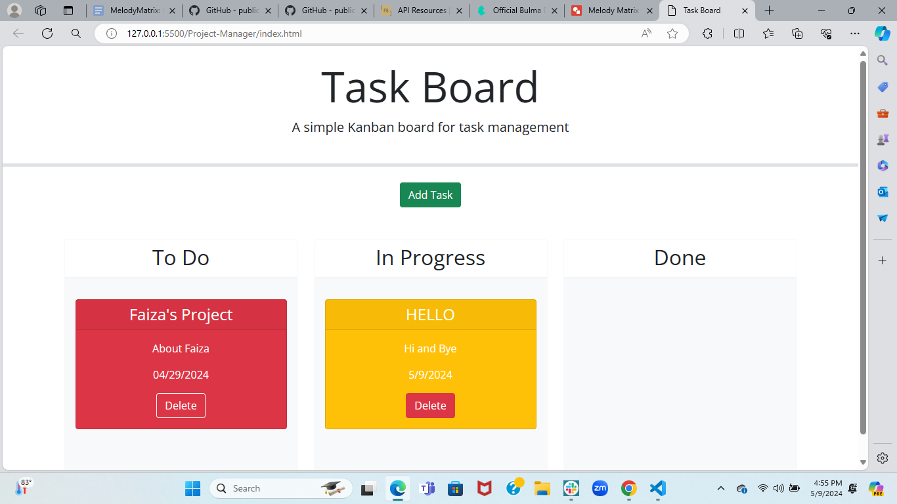
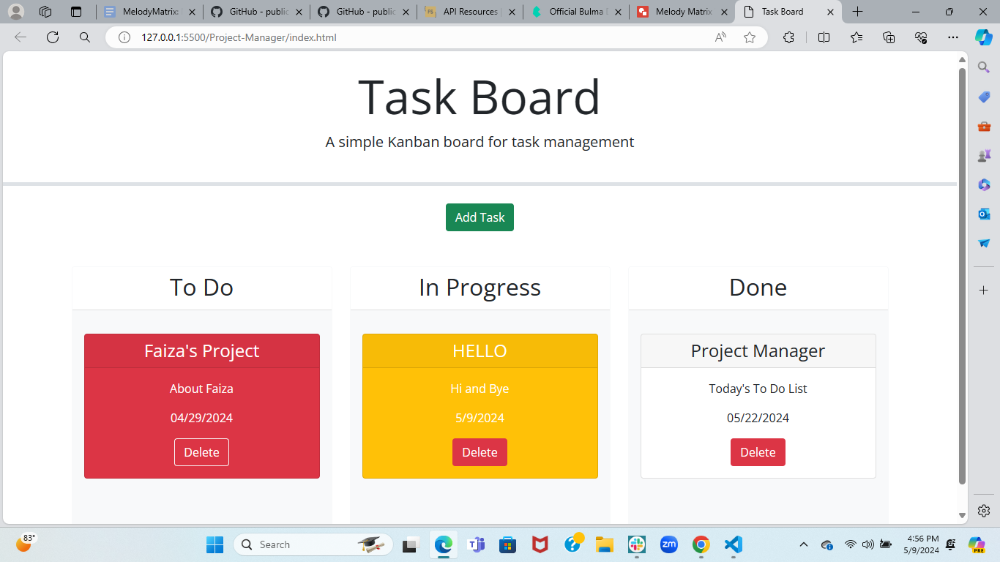

# Project-Manager

## Description

* I wanted to create a Task Board application that tracks your prajects with a title, description, and the date is is due by using a thrid-party APIs like jQueri, Bootstrap, Day.js and as well as addEventListener, localStorage, JSON.parse and JSON.stringify. All of these code and articles helped in creating my application. 

* There was a starter code given which I then modified necessary to my goal

* I discovered the following:
- Bootstap components that have Modals and Forms
- jQuery Interactions Draggable and Droppable
- jQuery Widget Datepicker and Day.js
- Adding dates using jQuery Widget Datepicker and Day.js

## Deployed Link
[deployed link](https://faiza-haque.github.io/Project-Manager/)

## Screenshot of Project

  

## Credits
- [links]
( https://getbootstrap.com/docs/5.3/components/modal/)
(https://getbootstrap.com/docs/5.3/forms/overview/)
(https://jqueryui.com/draggable/)
(https://jqueryui.com/droppable/)
(https://jqueryui.com/datepicker/)
(https://day.js.org/en/)
- [BlackBox] Blackbox code autocomplete is build to make developers faster while writing code. This Machine Learning program helped me with my comments and helped me understand the code I was writing.
- [W3Schools] W3Schools is a free web resource that provides information about HTML, CSS, and JavaScript. It is a great resource for learning web development.

## Acknowledgments 
- Tutors and TAs
- My Classmates
- My Instructor
- My Friends
Everyone listed helped me complete this project. I would like to thank them for their support.